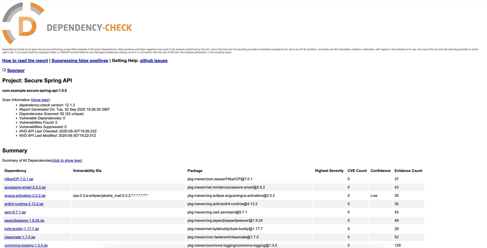

# Secure Spring API

Безопасное REST API на Spring Boot с JWT аутентификацией, валидацией данных и проверкой уязвимостей зависимостей.

## Описание проекта

Проект реализует безопасное REST API с использованием Spring Boot и Spring Security. Основные функции включают аутентификацию по JWT токенам, управление данными пользователей и проверку безопасности зависимостей через OWASP Dependency-Check.

## Технологии

- Java 17
- Spring Boot 3.x
- Spring Security 6.x
- JWT (jjwt 0.11.5)
- SQLite
- Hibernate ORM
- Maven
- OWASP Dependency-Check
- SpotBugs

## API Endpoints

### Аутентификация

#### Регистрация пользователя

```bash
curl -X POST http://localhost:8080/auth/register \
  -H "Content-Type: application/json" \
  -d '{
    "username": "testuser",
    "email": "test@example.com",
    "password": "password123"
  }'
```

Ответ при успешной регистрации:
```json
{
  "message": "User registered successfully"
}
```

Ответ при ошибке:
```json
{
  "error": "Username or email already exists"
}
```

#### Вход в систему

```bash
curl -X POST http://localhost:8080/auth/login \
  -H "Content-Type: application/json" \
  -d '{
    "username": "testuser",
    "password": "password123"
  }'
```

Ответ при успешном входе:
```json
{
  "token": "eyJhbGciOiJIUzI1NiIsInR5cCI6IkpXVCJ9...",
  "type": "Bearer",
  "username": "testuser"
}
```

Ответ при ошибке аутентификации:
```json
{
  "error": "Invalid credentials"
}
```

### Управление данными (требует аутентификации)

#### Получение всех данных

```bash
curl -X GET http://localhost:8080/api/data \
  -H "Authorization: Bearer YOUR_JWT_TOKEN"
```

Ответ:
```json
[
  {
    "id": 1,
    "title": "Example Title",
    "content": "Example Content",
    "createdAt": "2024-01-15T10:30:00",
    "author": "username"
  }
]
```

#### Создание новой записи

```bash
curl -X POST http://localhost:8080/api/data \
  -H "Authorization: Bearer YOUR_JWT_TOKEN" \
  -H "Content-Type: application/json" \
  -d '{
    "title": "New Item",
    "content": "Item content"
  }'
```

Ответ при успешном создании:
```json
{
  "id": 2,
  "title": "New Item",
  "content": "Item content",
  "createdAt": "2024-01-15T11:00:00",
  "author": "current_user"
}
```

Ответ при ошибке:
```json
{
  "error": "Title and content are required"
}
```

## Проверка безопасности

### OWASP Dependency-Check

Запуск проверки уязвимостей в зависимостях:

```bash
mvn dependency-check:check -Dnvd.api.key="your-api-key"
```

Отчет генерируется в: `target/dependency-check-report.html`

### SpotBugs

Статический анализ кода:

```bash
mvn spotbugs:check
```

## Сборка и запуск

1. Сборка проекта:
```bash
mvn clean package
```

2. Запуск приложения:
```bash
java -jar target/secure-spring-api-1.0.0.jar
```

3. Приложение доступно по адресу: `http://localhost:8080`

## Особенности реализации

- JWT аутентификация с Bearer токенами
- Валидация входных данных через Spring Validation
- Ролевая модель доступа с аннотацией `@PreAuthorize`
- Обработка ошибок с возвратом структурированных JSON ответов
- Интеграция с OWASP Dependency-Check для сканирования уязвимостей
- Статический анализ кода через SpotBugs

## Скриншоты OWASP Dependency-Check




